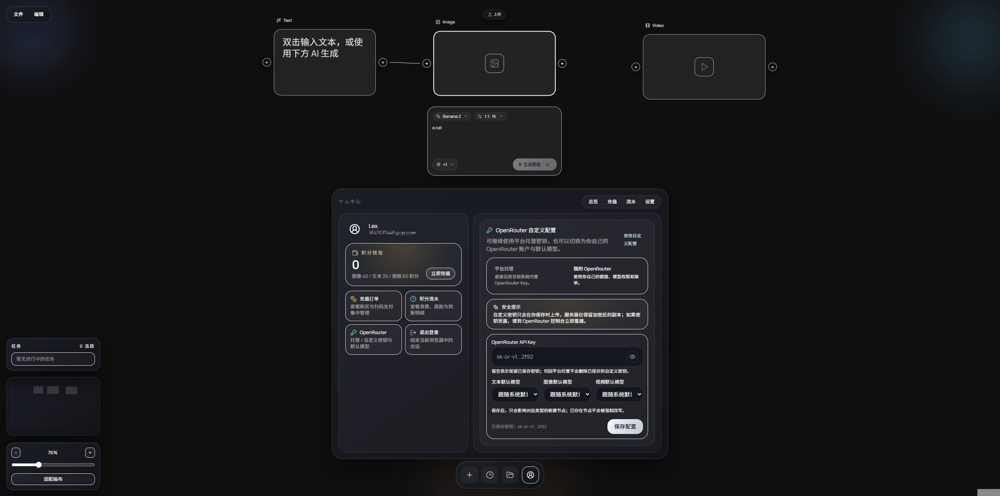

# Infinite Studio



基于 React Flow + FastAPI 的可视化 AI 画布工作室。

## 技术栈

- 前端：React 18、Vite 5、TypeScript、Tailwind CSS、React Flow、Zustand、i18next
- 后端：Python 3.12、FastAPI、Poetry、HTTPX

## 项目结构

- `frontend/`：Vite + React 应用，单元测试在 `src/**/__tests__`，E2E 测试在 `tests/e2e`
- `backend/`：FastAPI 应用及后端测试
- `docs/`：部署指南、快速开始等补充文档
- `scripts/`：QA 验证工具及归档脚本

## 启动前端

```bash
cd frontend
npm install
cp .env.example .env
npm run dev
```

默认地址：`http://localhost:15191`

在 `frontend/.env` 中设置 `VITE_API_BASE_URL` 指向后端地址，默认为 `http://localhost:18000`。

## 启动后端

```bash
cd backend
poetry install
cp .env.example .env
poetry run uvicorn app.main:app --reload --port 18000
```

后端支持多 Provider 图像生成：

- `provider: openrouter`（默认）
- `provider: openai`

如果 Poetry 因网络问题安装失败，可用 pip 替代：

```bash
cd backend
python -m pip install fastapi "uvicorn[standard]" httpx pydantic pydantic-settings python-multipart python-dotenv
uvicorn app.main:app --reload --port 18000
```

## Docker 启动（可选）

```bash
docker compose up
```

## 功能特性

- **可视化 AI 画布**：基于 React Flow 的节点编辑、连线工作流、媒体串联
- **AI 集成**：多 Provider 支持（OpenRouter、OpenAI）
- **文件上传**：支持图片、视频、文本文件
- **现代化技术栈**：React 18 + FastAPI + TypeScript + Python 3.12
- **响应式设计**：支持桌面和移动端
- **工作室导航**：左上菜单栏、浮动创建 Dock、小地图、缩放面板、任务条

## 部署到云端

查看详细 [部署指南](./docs/deployment.md)：

- **Vercel**（前端）和 **Railway**（后端）的分步部署说明
- 环境变量与 API Key 配置
- 生产环境 CORS 配置
- 持续部署工作流
- 费用估算（可完全免费！）

**快速链接：**
- ⚡ [快速开始](./docs/quick-start.md)
- 📖 [完整部署指南](./docs/deployment.md)

## API 接口

| 接口 | 方法 | 说明 |
|------|------|------|
| `/api/health` | GET | 健康检查 |
| `/api/upload` | POST | 文件上传 |
| `/api/generate-text` | POST | 文本生成 |
| `/api/generate-image` | POST | 图像生成 |
| `/api/generate-video` | POST | 视频生成 |
| `/api/models` | GET | 获取可用模型列表 |

## 参与贡献

欢迎提交 Pull Request！

## 许可证

本项目基于 MIT 许可证开源。
