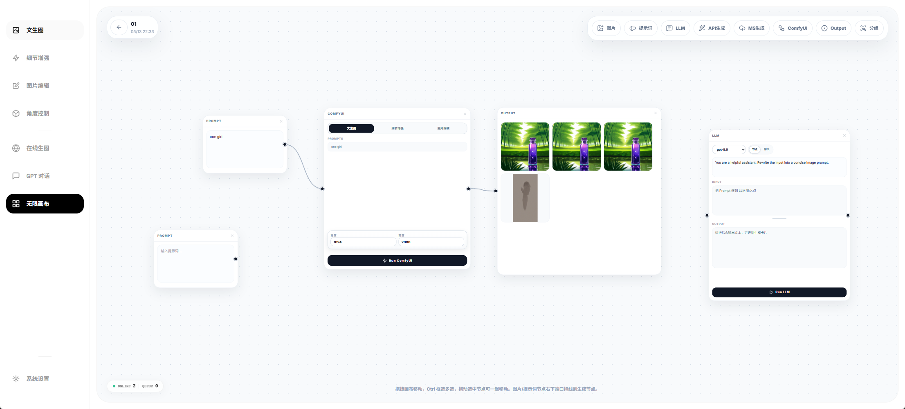

# Infinite Canvas - AI 无限画布

<p align="center">
  <strong>基于节点式工作流的 AI 创意画布平台</strong>
</p>

<p align="center">
  
</p>

---

##  项目简介

**Infinite Canvas** 是一个基于节点式工作流的 AI 创意画布平台，将 ComfyUI 图像生成、LLM 对话、提示词增强等多种 AI 能力整合在一个无限画布上。通过拖拽节点、连接管线的方式，用户可以自由组合 AI 工作流，实现从创意构思到图像生成的完整流程。

##  核心亮点

| 亮点 | 说明 |
|------|------|
|  **无限画布** | 自由拖拽、缩放、平移的无限工作空间，支持多画布管理 |
|  **节点式工作流** | 可视化节点连接，直观构建 AI 处理管线 |
| ️ **ComfyUI 集成** | 支持本地 ComfyUI 实例调用，自定义工作流生图 |
| 💬 **LLM 对话** | 内置 GPT 对话节点，支持提示词优化与对话生成 |
| 🔧 **提示词增强** | 自动优化和扩展图像生成提示词 |
|  **角度控制** | 支持图像角度、姿态等精细控制 |
| 🌐 **在线生图** | 集成 Comfly 在线 AI 生图服务 |
|  **本地存储** | 对话、画布、历史记录全部本地持久化 |
|  **实时通信** | WebSocket 实时推送生成进度与状态 |

## ️ 技术栈

### 后端

| 技术 | 用途 |
|------|------|
| **FastAPI** | 高性能异步 Web 框架 |
| **Python 3.10+** | 运行环境 |
| **WebSocket** | 实时双向通信 |
| **uvicorn** | ASGI 服务器 |

### 前端

| 技术 | 用途 |
|------|------|
| **HTML5 / CSS3** | 页面结构与样式 |
| **Tailwind CSS** | 原子化 CSS 框架 |
| **Lucide Icons** | 图标库 |
| **原生 JavaScript** | 画布交互与节点逻辑 |

### AI 服务

| 服务 | 用途 |
|------|------|
| **ComfyUI** | 本地 Stable Diffusion 图像生成 |
| **Comfly API** | 在线 AI 生图与聊天服务 |
| **GPT-3.5/4** | 提示词优化与对话 |

##  项目结构

```
Infinite-Canvas/
├── app/                    # 后端应用
│   ├── application.py      # FastAPI 应用入口
│   ├── core/               # 核心配置
│   ├── models/             # 数据模型
│   ├── routers/            # API 路由
│   │   ├── chat.py         # 聊天接口
│   │   ├── comfy.py        # ComfyUI 接口
│   │   ├── settings.py     # 设置接口
│   │   ├── storage.py      # 存储接口
│   │   └── utility.py      # 工具接口
│   ├── services/           # 业务服务
│   │   ├── canvas_service.py
│   │   ├── conversation_service.py
│   │   └── history_service.py
│   ├── utils/              # 工具函数
│   └── ws/                 # WebSocket 管理
├── static/                 # 前端静态页面
│   ├── canvas.html         # 无限画布主页面
│   ├── index.html          # 首页
│   ├── gpt-chat.html       # GPT 对话页面
│   ├── online.html         # 在线生图页面
│   ├── enhance.html        # 提示词增强页面
│   ├── angle.html          # 角度控制页面
│   ├── settings.html       # 系统设置页面
│   └── ...
├── workflows/              # ComfyUI 工作流定义
├── packages/               # 离线依赖包
├── main.py                 # 启动入口
└── pyproject.toml          # 项目配置
```

## 🚦 快速开始

### 环境要求

- Python 3.10+
- （可选）本地 ComfyUI 实例

### 安装依赖

```bash
# Windows 一键安装
安装依赖.bat

# 或手动安装
pip install -r requirements.txt
```

### 配置 API Key

1. 复制 `.env.example` 到 `API/.env`
2. 填写你的 Comfly API Key：

```env
COMFLY_API_KEY=sk-xxxxx
COMFYUI_INSTANCES=127.0.0.1:8188,127.0.0.1:4090
```

### 启动服务

```bash
# Windows 一键启动
启动服务.bat

# 或手动启动
python main.py
```

服务启动后访问：**http://127.0.0.1:3000/**

##  功能模块

### 无限画布

核心工作区，支持：
- 拖拽画布移动，Ctrl 框选多选
- 节点拖线连接，构建处理管线
- 图片/提示词节点拖拽到生成节点
- 多画布切换与管理

### 文生图

通过文本提示词生成图像，支持：
- 自定义分辨率设置
- ComfyUI 工作流调用
- 在线 AI 生图服务

### 提示词增强

利用 LLM 自动优化和扩展提示词，提升生成质量。

### GPT 对话

内置 AI 对话功能，支持：
- 多轮对话
- 提示词生成辅助
- 创意灵感激发

### 系统设置

管理 API 配置、ComfyUI 实例、用户偏好等。

## 📝 许可证

本项目仅供学习与研究使用。

---

<p align="center">Made with ❤️ by Infinite Canvas Team</p>
