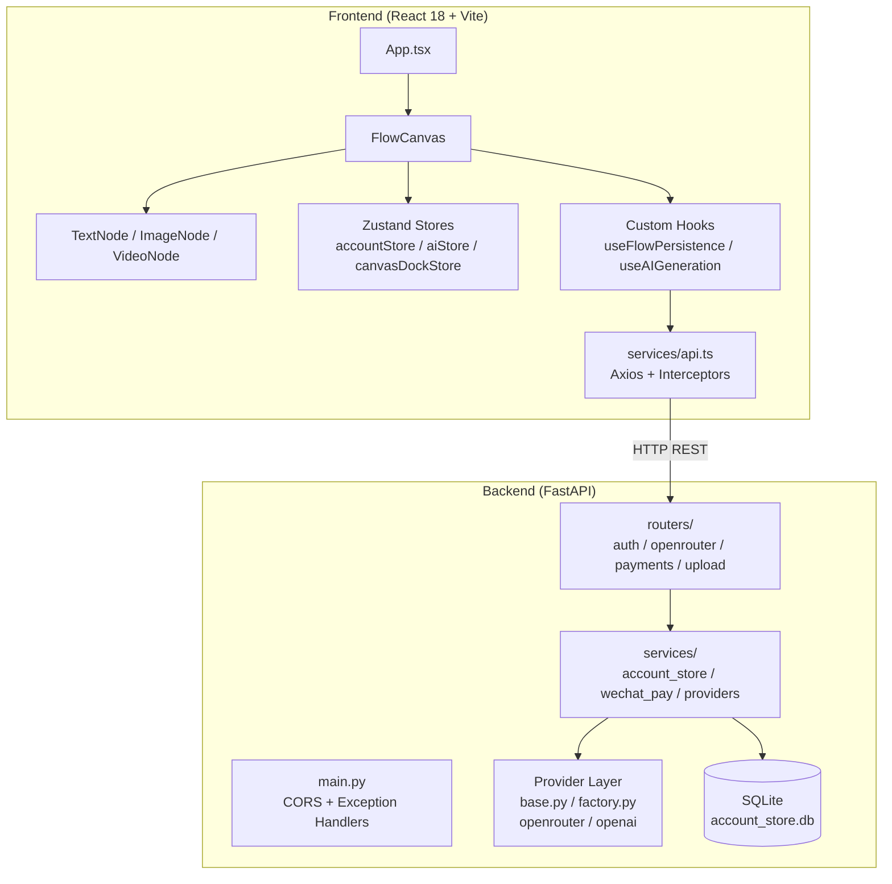

# Infinite Studio — 全面源码深度解析

## 1. 项目全景概览

### 项目背景与核心问题

**Infinite Studio** 是一个基于 **React Flow** + **FastAPI** 的**可视化 AI 创作画布**。它解决的核心问题是：**让用户通过"节点连线"的方式，可视化地编排 AI 图像/视频/文本生成任务**，类似 ComfyUI 的理念，但以 Web 应用形态交付，无需本地安装模型。

### 核心竞争力

| 能力 | 说明 |
|------|------|
| **可视化节点编排** | 基于 React Flow，支持文本/图像/视频三种节点，通过连线传递数据 |
| **多 Provider AI 生成** | 后端抽象了 Provider 层，支持 OpenRouter 和 OpenAI 双后端 |
| **积分/账户体系** | SQLite 持久化，注册送分、生成扣分、失败自动退分 |
| **微信支付充值** | Native 扫码支付，回调确认后到账 |
| **画布持久化** | localStorage 自动保存，支持 JSON 导入/导出，兼容旧版 tldraw 数据迁移 |

### 功能模块一览

| 模块 | 前端位置 | 后端位置 | 职责 |
|------|----------|----------|------|
| 画布引擎 | `components/canvas/` | — | React Flow 画布、节点创建、连线、缩放 |
| 节点渲染 | `components/nodes/flow/` | — | TextNode / ImageNode / VideoNode |
| AI 生成 | `services/api.ts` + hooks | `routers/openrouter.py` | 图像/文本/视频生成 API 调用 |
| 账户系统 | `stores/accountStore.ts` | `services/account_store.py` | 注册/登录/积分/Session |
| 支付系统 | hooks/useRechargePolling | `services/wechat_pay.py` + `routers/payments.py` | 微信 Native 支付 |
| 文件上传 | hooks/useAssetImport | `routers/upload.py` | 图片/视频/文本上传 |
| 持久化 | hooks/useFlowPersistence | — | localStorage 画布存取 |

### 适用场景

- AI 图像创作工作流（文生图、图生图链）
- AI 视频生成编排
- 多模态 AI 内容管道（文本→图像→视频链式生成）
- 教学演示 AI 节点式编程

---

## 2. 整体架构设计

### 高层架构图

```
┌─────────────────────────────────────────────────────────────┐
│                      Frontend (React 18)                     │
│                                                             │
│  ┌──────────┐  ┌──────────┐  ┌──────────┐  ┌────────────┐  │
│  │ FlowCanvas│  │  Nodes   │  │  Stores  │  │   Hooks    │  │
│  │ (React   │──│ Text/    │  │ Zustand  │──│ useFlow*   │  │
│  │  Flow)   │  │ Image/   │  │ account/ │  │ useAI*     │  │
│  └──────────┘  │ Video    │  │ ai/      │  │ useAsset*  │  │
│       │        └──────────┘  │ canvas/  │  └────────────┘  │
│       │                      └──────────┘          │        │
│  ┌────┴────────────────────────────────────────┐   │        │
│  │           services/api.ts (Axios)           │◄──┘        │
│  │     interceptor: token注入 / 401处理        │            │
│  └─────────────────────┬───────────────────────┘            │
└────────────────────────┼────────────────────────────────────┘
                         │ HTTP (REST)
┌────────────────────────┼────────────────────────────────────┐
│                  Backend (FastAPI)                           │
│  ┌─────────────────────┴───────────────────────┐            │
│  │              routers/ (API 路由层)            │            │
│  │  auth / openrouter / payments / upload       │            │
│  └─────────────────────┬───────────────────────┘            │
│                        │                                    │
│  ┌─────────────────────┴───────────────────────┐            │
│  │           services/ (业务逻辑层)              │            │
│  │  ┌──────────┐ ┌──────────┐ ┌──────────────┐ │            │
│  │  │providers/│ │ account_ │ │ wechat_pay   │ │            │
│  │  │ factory  │ │ store.py │ │ .py          │ │            │
│  │  │ openrouter│ │ (SQLite) │ │ (微信SDK)    │ │            │
│  │  │ openai   │ └──────────┘ └──────────────┘ │            │
│  │  └──────────┘                                │            │
│  └──────────────────────────────────────────────┘            │
│  ┌──────────────────────────────────────────────┐            │
│  │  .data/account_store.db (SQLite + WAL)       │            │
│  └──────────────────────────────────────────────┘            │
└─────────────────────────────────────────────────────────────┘
```

### Mermaid 组件图



### 核心设计模式

#### 1. 策略模式 (Strategy) — Provider 抽象

```python
# backend/app/services/providers/base.py
class ModelProvider(ABC):       # 抽象策略
    @abstractmethod
    async def generate_image(self, payload): ...
    @abstractmethod
    async def generate_video(self, payload): ...
    @abstractmethod
    async def generate_text(self, payload): ...

# backend/app/services/providers/factory.py
def get_provider(provider_name, *, user_id):
    if resolved == "openai": return OpenAIProvider()     # 具体策略 A
    return OpenRouterProvider(api_key=user_api_key)       # 具体策略 B
```

#### 2. 工厂模式 (Factory) — 节点创建

```typescript
// frontend/src/components/canvas/flowNodeFactory.ts
export function createFlowNode(type: FlowNodeType, x, y, existingNodes?): AnyFlowNode {
    const data = makeNodeData(type)   // 根据 type 创建不同 data
    // 防重叠逻辑...
    return { id, type, position, data } as AnyFlowNode
}
```

#### 3. 观察者模式 (Observer) — Zustand Store

Zustand 本质是发布-订阅：组件通过 selector 订阅 store 的某个切片，状态变化时精确重渲染。

#### 4. Context Manager 模式 — 积分扣费/退还

```python
# backend/app/routers/openrouter.py
@asynccontextmanager
async def consume_with_refund(user_id, cost_type, description):
    current_user = account_store.consume_points(...)  # 先扣
    try:
        yield current_user                            # 执行生成
    except (ProviderError, Exception):                # 失败
        account_store.refund_points(...)              # 自动退还
        raise
```

### 设计权衡 (Trade-offs)

| 决策 | 权衡 |
|------|------|
| SQLite 而非 PostgreSQL | 简单部署 vs 并发上限（WAL 模式缓解了部分问题） |
| localStorage 持久化画布 | 零后端依赖 vs 跨设备同步缺失 |
| 单线程 Lock 保护 SQLite | 简化并发 vs 高吞吐瓶颈 |
| httpx 每次 new AsyncClient | 简洁无状态 vs 连接池复用缺失 |

---

## 3. 核心原理与理论基础

### 3.1 React Flow 节点-连线数据模型

核心数据结构是 **有向图**：`Node[]` + `Edge[]`。

```
Node = { id, type, position: {x,y}, data: {...} }
Edge = { id, source, target, sourceHandle, targetHandle }
```

本项目的关键创新是 **FlowPayload 系统**——在 Edge 之上构建了类型化的数据传递语义：

```typescript
// frontend/src/components/nodes/flow/types.ts
type FlowPayload = {
    id: string
    kind: 'text' | 'image' | 'video' | 'audio'  // 数据类型
    label: string
    sourceNodeId: string
    textValue?: string     // 文本内容
    previewUrl?: string    // 媒体预览
}
```

每个节点维护 `inputPayloads`（来自上游连线的数据）和 `outputPayloads`（自己产出的数据），通过 `syncNodeInputs()` 函数在 edges 变化时自动同步。

### 3.2 连线兼容性检查算法

```typescript
// frontend/src/components/canvas/flowPayloads.ts
function isNodeConnectionCompatible(sourceNode, targetNode): boolean {
    const sourcePayloads = buildNodeOutputs(sourceNode)  // 源节点能输出什么
    if (sourcePayloads.length === 0) {
        // 还没生成内容时，用"潜在输出"判断
        return buildPotentialNodeOutputs(sourceNode)
            .some(payload => acceptsPayload(targetNode, payload))
    }
    return sourcePayloads.some(payload =>
        selectedOutputIds.includes(payload.id) &&
        acceptsPayload(targetNode, payload)     // 目标节点能否接收
    )
}

function acceptsPayload(node, payload): boolean {
    if (node.type === 'text-node') return true  // 文本节点接受一切
    if (node.type === 'image-node') return payload.kind === 'text' || 'image'
    return payload.kind === 'text' || 'image' || 'video'  // video 节点
}
```

**兼容性矩阵**:

| 源节点输出 ↓ \ 目标节点 → | text-node | image-node | video-node |
|---------------------------|-----------|------------|------------|
| text                      | ✅        | ✅         | ✅         |
| image                     | ✅        | ✅         | ✅         |
| video                     | ✅        | ❌         | ✅         |
| audio                     | ✅        | ❌         | ❌         |

### 3.3 Provider 响应 URL 递归提取

OpenRouter 返回的 JSON 结构不固定，项目使用递归遍历提取 URL：

```python
# backend/app/services/providers/openrouter_provider.py
def _traverse_provider_response(data, *, url_keys, container_keys, max_depth=6):
    seen = set()
    def extract(value, depth):
        if depth > max_depth: return
        if isinstance(value, str) and value not in seen:
            seen.add(value); yield value; return
        if isinstance(value, dict):
            for key, val in value.items():
                if key in url_keys:       # "url", "image_url", "imageUrl"
                    yield from extract(val, depth)
                elif key in container_keys:  # "images"
                    for item in val: yield from extract(item, depth+1)
                else: yield from extract(val, depth+1)
```

### 3.4 积分经济模型

```
注册奖励: 120 积分
图像生成: -40 积分/次
文本生成: -25 积分/次
视频生成: -60 积分/次

充值套餐:
  Starter: ¥29  → 200 + 20 = 220 积分
  Creator: ¥59  → 500 + 80 = 580 积分
  Studio:  ¥109 → 1000 + 180 = 1180 积分
```

---

## 4. 目录结构与代码组织分析

```
infinite-canvas/
├── frontend/                      # React 18 + Vite + TypeScript
│   ├── src/
│   │   ├── main.tsx               # 入口：挂载 App, 配置 authBridge
│   │   ├── App.tsx                # 根组件：背景渐变 + FlowCanvas
│   │   ├── components/
│   │   │   ├── canvas/            # ★ 画布核心（15 个文件）
│   │   │   │   ├── FlowCanvas.tsx       # 画布主控（600 行）
│   │   │   │   ├── flowNodeFactory.ts   # 节点工厂
│   │   │   │   ├── flowPayloads.ts      # Payload 同步引擎
│   │   │   │   ├── flowConnectionUtils.ts
│   │   │   │   ├── CanvasDock.tsx       # 左侧浮动 Dock
│   │   │   │   ├── CanvasMenuBar.tsx    # 顶部菜单栏
│   │   │   │   └── ...
│   │   │   ├── nodes/flow/        # ★ 节点组件
│   │   │   │   ├── types.ts             # 核心类型定义
│   │   │   │   ├── TextNode.tsx
│   │   │   │   ├── ImageNode.tsx
│   │   │   │   ├── VideoNode.tsx
│   │   │   │   └── common.tsx           # 共享 UI（shell/tooltip/ports）
│   │   │   └── edges/CustomEdge.tsx     # 自定义连线样式
│   │   ├── stores/                # Zustand 状态管理
│   │   │   ├── accountStore.ts          # 账户/Session
│   │   │   ├── aiStore.ts               # AI 任务追踪
│   │   │   ├── canvasDockStore.ts       # Dock/资产/历史
│   │   │   └── preferenceStore.ts       # 用户偏好
│   │   ├── hooks/                 # 自定义 Hooks（10 个）
│   │   │   ├── useFlowPersistence.ts    # 画布 localStorage 持久化
│   │   │   ├── useViewportPersistence.ts
│   │   │   ├── useAIGeneration.ts
│   │   │   ├── useAccount.ts
│   │   │   ├── useOpenRouterModels.ts
│   │   │   └── ...
│   │   ├── services/
│   │   │   ├── api.ts             # ★ Axios 封装 + 响应归一化
│   │   │   └── authBridge.ts      # Token 桥接
│   │   └── i18n/                  # 国际化配置
│   └── tests/                     # Playwright E2E 测试
│
├── backend/                       # Python 3.12 + FastAPI
│   ├── app/
│   │   ├── main.py                # FastAPI 应用入口 + 中间件
│   │   ├── config.py              # pydantic-settings 配置
│   │   ├── rate_limit.py          # slowapi 限流
│   │   ├── routers/               # ★ API 路由层
│   │   │   ├── auth.py                  # 注册/登录/设置
│   │   │   ├── openrouter.py            # 图像/文本/视频生成
│   │   │   ├── payments.py              # 微信支付
│   │   │   ├── upload.py                # 文件上传
│   │   │   └── health.py                # 健康检查
│   │   ├── services/              # ★ 业务逻辑层
│   │   │   ├── account_store.py         # SQLite 账户存储（1400+ 行）
│   │   │   ├── wechat_pay.py            # 微信支付 SDK 封装
│   │   │   ├── openrouter_client.py     # 旧版客户端（保留）
│   │   │   └── providers/               # Provider 抽象层
│   │   │       ├── base.py              # ABC + 异常类
│   │   │       ├── factory.py           # 工厂函数
│   │   │       ├── openrouter_provider.py
│   │   │       └── openai_provider.py
│   │   └── models/
│   │       ├── requests.py              # Pydantic 请求模型
│   │       └── responses.py             # 响应模型
│   └── tests/                           # pytest 测试
│
├── docs/                          # 部署/快速开始文档
├── scripts/                       # QA 脚本
└── docker-compose.yml
```

### 初始化流程

**前端启动流程**:

```
main.tsx
  → authBridge.configure({ getToken: () => useAccountStore.getState().token })
  → ReactDOM.createRoot(<App>)
    → App.tsx → <FlowCanvas>
      → FlowCanvasInner
        → useFlowPersistence.loadFlow()        // 从 localStorage 恢复
        → setNodes / setEdges                  // 恢复节点和连线
        → createInitialCanvasState()           // 空画布（首次使用）
        → useViewportPersistence               // 恢复视口位置
```

**后端启动流程**:

```
main.py
  → get_settings()                             // pydantic-settings 加载 .env
  → FastAPI(state={limiter})                   // 创建应用
  → add_middleware(CORS)                       // 跨域配置
  → 注册异常处理器 (AccountStoreError, RateLimitExceeded)
  → include_router(5 个路由)                   // 注册所有 API 路由
  → AccountStore (首次请求时)
    → _connect() → _ensure_schema()            // 自动建表
    → _migrate_legacy_json_if_needed()         // JSON → SQLite 迁移
```

---

## 5. 关键模块/组件深度解析

### 5.1 FlowCanvas — 画布主控

**文件**: `frontend/src/components/canvas/FlowCanvas.tsx` (600 行)

**职责**: 整个画布的"大脑"——管理节点/边的生命周期、处理用户交互、协调持久化。

**核心流程**:

```
用户操作 → ReactFlow 事件回调
  ├─ onConnect → isValidConnection 检查 → addEdge
  ├─ onNodesChange → 尺寸变化时 updateNodeSize
  ├─ onNodesDelete → 清理关联 edges
  ├─ onContextMenu/DoubleClick → 打开节点创建菜单
  └─ CanvasDock 按钮 → appendNodeAtViewportCenter

数据流:
  nodes/edges 变化 → syncNodeInputs() → 更新 inputPayloads
                 → useFlowPersistence.saveFlow() → localStorage
```

**关键状态**:

| 状态 | 类型 | 用途 |
|------|------|------|
| `nodes` | `AnyFlowNode[]` | 所有画布节点 |
| `edges` | `Edge[]` | 所有连线 |
| `contextMenu` | `MenuPosition \| null` | 右键菜单位置 |
| `hydrated` | `boolean` | 是否已从 localStorage 恢复 |
| `menuNotice` | `{tone, message} \| null` | 菜单提示消息 |

### 5.2 flowPayloads — 数据传递引擎

**文件**: `frontend/src/components/canvas/flowPayloads.ts` (256 行)

**职责**: 在节点之间同步"数据包"(FlowPayload)，是连线功能的核心逻辑。

**核心函数**:

| 函数 | 作用 |
|------|------|
| `buildNodeOutputs(node)` | 从节点 data 提取可输出的 Payload 列表 |
| `buildPotentialNodeOutputs(node)` | 节点未生成内容时的"潜在输出" |
| `syncNodeInputs(nodes, edges)` | 遍历所有 edges，为每个节点计算 inputPayloads |
| `isNodeConnectionCompatible()` | 判断两个节点能否连线 |
| `acceptsPayload(node, payload)` | 判断节点能否接收某种类型的 Payload |
| `attachConnectionHints()` | 连线过程中给节点附加视觉提示状态 |
| `deriveTextPromptFromPayloads()` | 从 Payload 列表生成文本 prompt |

### 5.3 AccountStore — 账户存储引擎

**文件**: `backend/app/services/account_store.py` (1400+ 行)

**职责**: 用户注册、登录、Session 管理、积分系统、充值订单——全部基于 SQLite。

**数据表结构**:

```sql
users          -- 用户表（含 OpenRouter 设置）
sessions       -- 会话表（token_hash 索引）
ledger_entries -- 积分流水表
recharge_records -- 充值记录
recharge_orders  -- 微信支付订单
```

**关键设计**:
- **WAL 模式**: `PRAGMA journal_mode = WAL` 实现读写并发
- **线程安全**: `threading.Lock()` 保护所有写操作
- **密码迁移**: 兼容旧版 `sha256(salt:password)` → 自动升级为 `pbkdf2_sha256`
- **Session 安全**: token 存储哈希值，支持 token_hash 和 token 双重查询
- **自动建表 + 增量迁移**: `_ensure_schema()` 检测列缺失自动 ALTER TABLE
- **API Key 加密**: 使用 `cryptography.Fernet` 加密存储用户的 OpenRouter Key

### 5.4 Provider 抽象层

**文件**: `backend/app/services/providers/`

**职责**: 将不同 AI 服务（OpenRouter / OpenAI）统一为相同的接口。

```
ModelProvider (ABC)                    ← 抽象基类
  ├── OpenRouterProvider               ← /chat/completions 统一接口
  │     ├── generate_image()           ← 递归提取 image URL
  │     ├── generate_video()           ← 递归提取 video URL
  │     ├── generate_text()            ← 提取 message.content
  │     └── get_models()               ← /models 端点
  │
  └── OpenAIProvider                   ← /images/generations + /chat/completions
        ├── generate_image()           ← DALL-E 格式转换
        ├── generate_video()           ← 抛出 501 不支持
        ├── generate_text()            ← Chat Completions
        └── get_models()               ← 返回硬编码 gpt-image-1
```

**工厂函数** `get_provider()` 支持用户级自定义 API Key:
```python
if user_record["openrouter_mode"] == "custom":
    user_api_key = credentials  # 用户自己的 OpenRouter Key
return OpenRouterProvider(api_key=user_api_key)
```

### 5.5 useFlowPersistence — 画布持久化

**文件**: `frontend/src/hooks/useFlowPersistence.ts` (401 行)

**职责**: 将画布状态序列化到 localStorage，支持版本化、旧版 tldraw 数据迁移。

**关键特性**:
- `stripTransientNodeData()` 过滤临时 UI 状态（如 modelPickerOpen）
- `migrateLegacyTldrawProject()` 从旧版 tldraw 格式提取 shape/arrow → node/edge
- 版本号 `CURRENT_FLOW_VERSION = 1` 支持未来格式升级

### 5.6 services/api.ts — 前后端通信层

**文件**: `frontend/src/services/api.ts` (530 行)

**职责**: Axios 实例封装、请求拦截（token 注入）、响应拦截（401 处理）、响应归一化。

**核心 API 函数**:

| 函数 | 端点 | 用途 |
|------|------|------|
| `generateImage()` | POST /api/generate-image | 图像生成 |
| `generateVideo()` | POST /api/generate-video | 视频生成 |
| `generateText()` | POST /api/generate-text | 文本生成 |
| `uploadAsset()` | POST /api/upload | 文件上传 |
| `login()` | POST /api/auth/login | 登录 |
| `register()` | POST /api/auth/register | 注册 |
| `fetchAccountProfile()` | GET /api/account/profile | 获取用户信息 |
| `createWeChatRechargeOrder()` | POST /api/payments/wechat/orders | 创建充值订单 |
| `fetchModels()` | GET /api/models | 获取可用模型列表 |

---

## 6. 关键函数/类实现细节

### 6.1 `FlowCanvasInner` — 画布核心控制器

**为什么选它**: 这是整个前端的中枢，600 行代码管理所有画布交互。

**文件**: `frontend/src/components/canvas/FlowCanvas.tsx:164-592`

```typescript
function FlowCanvasInner() {
  // React Flow 提供的核心 API
  const { deleteElements, fitView, getNodes, getViewport,
          screenToFlowPosition, setViewport } = useReactFlow<AnyFlowNode>()

  // 节点和边的状态管理（React Flow 内置 hook）
  const [nodes, setNodes, onNodesChangeBase] = useNodesState<AnyFlowNode>([])
  const [edges, setEdges, onEdgesChange] = useEdgesState<Edge>([])

  // 初始化：从 localStorage 恢复
  useEffect(() => {
    const snapshot = loadFlow()           // 读取 localStorage
    setNodes(snapshot.nodes)              // 恢复节点
    setEdges(snapshot.edges)              // 恢复连线
    initialViewportRef.current = snapshot.viewport ?? null
    setHydrated(true)
  }, [loadFlow])

  // 自动保存：nodes/edges/viewport 变化时写入 localStorage
  useLayoutEffect(() => {
    if (!hydrated) return
    saveFlow(nodes, edges, getViewport())
  }, [edges, getViewport, hydrated, nodes, saveFlow])

  // 连线验证：防止自连和类型不兼容的连线
  const isValidConnection = useCallback((connection) => {
    if (connection.source === connection.target) return false  // 禁止自连
    return isNodeConnectionCompatible(sourceNode, targetNode)  // 类型检查
  }, [nodes])

  // 连线创建：添加自定义 edge
  const onConnect = useCallback((connection) => {
    if (!isValidConnection(connection)) return
    setEdges(current => addEdge({
      ...connection,
      id: `edge-${Date.now()}-${Math.random().toString(36).slice(2, 8)}`,
      type: 'custom',
    }, current))
  }, [isValidConnection])

  // 节点同步：edges 变化时重新计算所有节点的 inputPayloads
  useEffect(() => {
    setNodes(current => {
      const next = syncNodeInputs(current, edges)
      return next.changed ? next.nodes : current
    })
  }, [edges, nodes])
}
```

**数据流向**: `用户拖拽连线 → onConnect → addEdge → edges 变化 → syncNodeInputs → nodes 更新 → 自动保存`

---

### 6.2 `syncNodeInputs` — Payload 同步引擎

**为什么选它**: 这是连线数据传递的核心算法，决定了"连一条线后，下游节点能看到什么数据"。

**文件**: `frontend/src/components/canvas/flowPayloads.ts:137-243`

```typescript
export function syncNodeInputs(nodes: AnyFlowNode[], edges: Edge[]) {
  const nodeMap = new Map(nodes.map(node => [node.id, node]))
  let changed = false

  const nextNodes = nodes.map(node => {
    // 1. 计算当前节点的输出 Payload
    const outputs = buildNodeOutputs(node)

    // 2. 找到所有指向当前节点的 edges
    const incoming = edges.filter(edge => edge.target === node.id)

    // 3. 从上游节点提取可接受的 Payload
    const payloads = incoming.flatMap(edge => {
      const source = nodeMap.get(edge.source)
      const sourceOutputs = buildNodeOutputs(source)
      return sourceOutputs.filter(payload =>
        acceptsPayload(node, payload) &&     // 类型兼容检查
        selectedOutputIds.includes(payload.id) // 上游选中的输出
      )
    })

    // 4. 自动选择逻辑：首次连接时自动全选
    const shouldAutoSelect = previousSelectedInputs.length === 0
                             && payloads.length > 0
    const nextSelected = shouldAutoSelect
      ? payloads.map(p => p.id)
      : selected

    // 5. 文本节点特殊处理：自动填充上游文本
    if (node.type === 'text-node') {
      const textPayload = selectedPayloads.find(
        p => p.kind === 'text' && p.textValue
      )
      if (textPayload && isPlaceholderText && !node.data.isEditing) {
        nextData.text = textPayload.textValue  // 自动填入上游文本
      }
    }

    // 6. 图像/视频节点：自动填入上游 prompt
    if (node.type === 'image-node' || node.type === 'video-node') {
      const textPayload = selectedPayloads.find(p => p.kind === 'text')
      if (textPayload && !node.data.prompt.trim()) {
        nextNode.data.prompt = textPayload.textValue
      }
    }
  })
  return { nodes: nextNodes, changed }
}
```

**设计亮点**: 自动选择 + 自动填入 prompt，让连线后立即可用，无需手动配置。

---

### 6.3 `createFlowNode` — 节点工厂（含防重叠）

**为什么选它**: 展示了节点创建的完整逻辑，包含实用的防重叠算法。

**文件**: `frontend/src/components/canvas/flowNodeFactory.ts:112-147`

```typescript
export function createFlowNode(
  type: FlowNodeType,
  x: number,
  y: number,
  existingNodes?: AnyFlowNode[]
): AnyFlowNode {
  const id = `${type}-${Date.now()}-${Math.random().toString(36).slice(2, 8)}`
  const data = makeNodeData(type)

  // 以点击位置为中心放置
  let px = x - data.w / 2
  let py = y - data.h / 2

  // 防重叠：最多尝试 20 次，每次向右下偏移 40px
  if (existingNodes && existingNodes.length > 0) {
    const GAP = 20, STEP = 40
    let attempts = 0
    while (attempts < 20) {
      const overlaps = existingNodes.some(n =>
        px < n.position.x + nw + GAP && px + data.w + GAP > n.position.x &&
        py < n.position.y + nh + GAP && py + data.h + GAP > n.position.y
      )
      if (!overlaps) break
      px += STEP; py += STEP; attempts++
    }
  }
  return {
    id, type,
    position: { x: px, y: py },
    data,
    style: { width: data.w, height: data.h }
  }
}
```

**防重叠算法**: AABB 碰撞检测 + 迭代偏移，最多 20 次尝试，步长 40px，间距 20px。

---

### 6.4 `consume_with_refund` — 积分扣费/退还 Context Manager

**为什么选它**: 展示了 Python 异步上下文管理器在业务中的优雅应用，保证了积分安全。

**文件**: `backend/app/routers/openrouter.py:46-91`

```python
@asynccontextmanager
async def consume_with_refund(user_id, cost_type, description):
    amount = GENERATION_COSTS[cost_type]  # image=40, text=25, video=60

    # 第一步：先扣积分
    current_user = account_store.consume_points(
        user_id=user_id, amount=amount,
        description=f"{cost_type.capitalize()} generation consumed points.",
    )

    try:
        yield current_user  # 执行 AI 生成
    except asyncio.CancelledError:
        # 用户取消 → 退还
        account_store.refund_points(user_id=user_id, amount=amount, ...)
        raise
    except ProviderError:
        # Provider 错误 → 退还
        account_store.refund_points(user_id=user_id, amount=amount, ...)
        raise
    except Exception:
        # 未知错误 → 退还
        account_store.refund_points(user_id=user_id, amount=amount, ...)
        raise
```

**调用链**: `generate_image endpoint → consume_with_refund → get_provider().generate_image() → 返回结果`

**设计亮点**: 用 `@asynccontextmanager` 将"扣费-执行-退费"的三步流程封装为原子操作，调用方只需 `async with` 即可。

---

### 6.5 `AccountStore._get_user_by_token` — Session 查询

**为什么选它**: 展示了安全的 token 查找策略（先哈希匹配，再明文回退）。

**文件**: `backend/app/services/account_store.py:584-609`

```python
def _get_user_by_token(self, connection, token):
    self._prune_expired_sessions(connection)  # 先清理过期 session
    token_hash = _hash_session_token(token)

    # 优先用哈希查询（更安全，不暴露明文 token）
    row = connection.execute("""
        SELECT users.* FROM sessions
        JOIN users ON users.id = sessions.user_id
        WHERE sessions.token_hash = ? AND sessions.expires_at > ?
    """, (token_hash, now_iso())).fetchone()
    if row: return row

    # 回退：兼容旧版无哈希的 session
    return connection.execute("""
        SELECT users.* FROM sessions
        JOIN users ON users.id = sessions.user_id
        WHERE sessions.token = ? AND sessions.expires_at > ?
    """, (token, now_iso())).fetchone()
```

**安全设计**: token 明文仅在创建时出现一次，之后只存哈希。回退查询兼容旧数据，登录时自动清理旧 session 并创建新的哈希 session。

---

### 6.6 `normalizeGenerateImageResponse` — 响应归一化

**为什么选它**: 不同 Provider 返回的图像数据格式差异巨大，这个函数统一了所有情况。

**文件**: `frontend/src/services/api.ts:347-394`

```typescript
export function normalizeGenerateImageResponse(
  payload: unknown
): NormalizedGenerateImageResponse {
  const choices = Array.isArray(record.choices) ? record.choices : []

  const collected = choices.flatMap(choice => {
    const message = choice.message

    // 情况 1: message.images[] (OpenRouter 标准)
    const directImages = Array.isArray(message?.images) ? message.images : []

    // 情况 2: message.content[].images[] (嵌套 content)
    const contentImages = Array.isArray(message?.content)
      ? message.content.flatMap(item => [...nestedImages, ...singular])
      : []

    // 情况 3: choice.content[] (另一种嵌套)
    const contentArray = Array.isArray(choice.content)
      ? choice.content.flatMap(...)
      : []

    // 统一通过 normalizeImageCandidate 处理
    return compactUrls([
      ...directImages, ...contentImages, ...contentArray
    ].map(normalizeImageCandidate))
  })

  return {
    provider: typeof record.provider === 'string' ? record.provider : undefined,
    images: Array.from(new Set(collected)),
    raw: payload
  }
}
```

**normalizeImageCandidate** 处理了 5 种图像格式:

| 格式 | 示例 | 处理方式 |
|------|------|---------|
| `url` | `"https://..."` | 直接使用 |
| `image_url.url` | `{image_url: {url: "..."}}` | 提取嵌套 url |
| `imageUrl.url` | `{imageUrl: {url: "..."}}` | camelCase 兼容 |
| `b64_json` | `"iVBOR..."` | 添加 `data:image/png;base64,` 前缀 |
| `data:` URI | `"data:image/png;..."` | 直接使用 |

---

### 6.7 `useFlowPersistence` + `migrateLegacyTldrawProject` — 数据迁移

**为什么选它**: 展示了产品迭代中的数据兼容策略。

**文件**: `frontend/src/hooks/useFlowPersistence.ts:245-351`

```typescript
export const migrateLegacyTldrawProject = (parsed: unknown): FlowSnapshot => {
  // 1. 递归收集所有带 id 的 record
  const byId = new Map<string, Record<string, unknown>>()
  collectRecords(parsed, byId, new Set(), 0)

  // 2. 筛选出 shape 类型的 record
  const shapeRecords = records.filter(r =>
    r.typeName === 'shape' || r.id?.startsWith('shape:')
  )

  // 3. 提取支持的节点类型
  const nodeRecords = shapeRecords.filter(r =>
    ['text-node', 'image-node', 'video-node'].includes(r.type)
  )

  // 4. 提取箭头 → 转换为 Edge
  const arrowRecords = shapeRecords.filter(r => r.type === 'arrow')
  const bindings = records.filter(r =>
    r.typeName === 'binding' && r.type === 'arrow'
  )

  // 5. 通过 binding 关联 arrow 的 start/end → 构建 Edge
  const edges = arrowRecords.map(arrow => {
    const binding = edgeBindings.get(arrowId)
    return {
      id, source: binding.start, target: binding.end, type: 'custom'
    }
  })

  return { nodes, edges }
}
```

**迁移策略**: 递归遍历旧版 tldraw 数据 → 按 typeName 筛选 shape/binding → 映射为 React Flow 的 Node/Edge 格式。

---

## 7. 扩展与进阶学习路径

### 推荐阅读顺序

| 顺序 | 文件 | 理由 |
|------|------|------|
| 1 | `frontend/src/components/nodes/flow/types.ts` | 先理解核心类型系统 |
| 2 | `frontend/src/components/canvas/flowPayloads.ts` | 理解数据传递机制 |
| 3 | `frontend/src/components/canvas/FlowCanvas.tsx` | 理解画布主控逻辑 |
| 4 | `frontend/src/components/nodes/flow/ImageNode.tsx` | 最完整的节点实现 |
| 5 | `frontend/src/services/api.ts` | 前后端通信层 |
| 6 | `backend/app/services/providers/base.py` → `factory.py` → `openrouter_provider.py` | Provider 链路 |
| 7 | `backend/app/services/account_store.py` | 账户系统全貌 |
| 8 | `backend/app/routers/openrouter.py` | 理解扣费+生成的完整流程 |

### 常见痛点与二次开发技巧

1. **添加新节点类型**: 在 `types.ts` 定义 data 类型 → `flowNodeFactory.ts` 添加默认值 → 创建组件 → 注册到 `FlowCanvas` 的 `nodeTypes` → 更新 `flowPayloads.ts` 的兼容性检查
2. **添加新 Provider**: 继承 `ModelProvider` → 实现 4 个抽象方法 → 在 `factory.py` 注册
3. **修改积分策略**: 编辑 `account_store.py` 的 `GENERATION_COSTS` 和 `RECHARGE_PACKAGES`
4. **画布数据格式变更**: 递增 `CURRENT_FLOW_VERSION`，在 `hydratePersistedFlow` 添加迁移逻辑

### 如果你想自己实现类似功能

重点关注:
- **React Flow 的 nodeTypes/edgeTypes 注册机制** — 这是扩展节点的基础
- **Zustand 的 selector 模式** — 控制重渲染范围
- **Pydantic 的 field_validator** — 请求数据清洗
- **SQLite WAL + BEGIN IMMEDIATE** — 简单可靠的并发写入
- **asynccontextmanager** — 资源安全的扣费/退还模式

### 相关技术文档

- [React Flow 文档](https://reactflow.dev/)
- [Zustand 文档](https://docs.pmnd.rs/zustand)
- [FastAPI 文档](https://fastapi.tiangolo.com/)
- [OpenRouter API](https://openrouter.ai/docs)
- [微信支付 Native 支付](https://pay.weixin.qq.com/docs/merchant/apis/native-payment/place-an-order.html)
